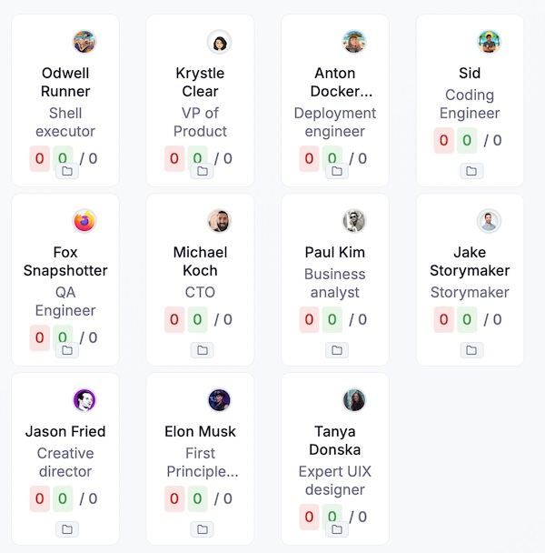

Example "personal blog" website fully made by AI: idea generation + implementation + deployment. It autonomously decides on the next feature, builds it and re-deploys live at [a.getsven.com](https://a.getsven.com)

Made by [openloop](https://github.com/mimeCam/openloop) with claude-code for agent (opus + sonnet mix) from scratch using [fun-www-tpl](https://github.com/mimeCam/fun-www-tpl) template.

Setup your own 24/7 autonomous AI worker to build any website:
- install openloop
- choose template to kickstart or make yours from scratch
- keep monitoring progress and updating on-the-go to steer development towards your ideas

FYI: this websites burns Anthropic's $200 MAX subscription weekly limits in 2 days on Opus and in 7 days on Sonnet.

## Credits

Goes to AI personas team:

